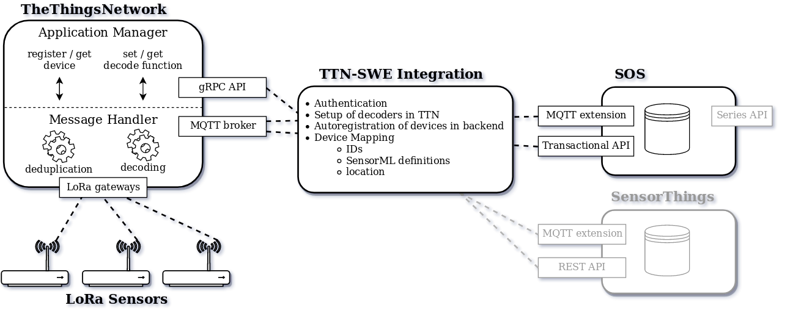

# The Things Network -- OGC SensorWeb Integration

This is a node.js based integration between [The Things Network](https://thethingsnetwork.org) (TTN) and the OGC SensorWeb, providing seamless measurement upload from LoRaWAN connected sensors into OGC infrastructure.
Specifically the SOS is implemented as storage backend. Building on a modular architecture, support for more backends is planned.
Besides measurement upload, the goal is to manage devices in both platforms consistently by automatically registering or updating them in the counterpart platform.



This project was developed in the course of [52°North's Student Innovation Challenge](http://52north.org/about/other-activities/student-innovation-prize) 2017 against the [SOS implementation by 52°North](https://github.com/52north/SOS).

## Features
- Passes messages from LoRaWAN connected sensors to a OGC storage backend
    - SOS Transactional API 2.0
    - SOS MQTT extension (currently available in [SOS development version](https://github.com/SeBaDro/SOS/tree/feature/mqtt))
    - easily extendable to other backends (roadmap: SensorThings API)
- Configuration Sync: Register a device once in TTN; done!
    - no hassle with SensorML & co
- Simple declarative bridge definition via YAML configuration file
- Scales well for multiple sensor types & storage backends

## User Setup guide
For a comprehensive guide of setting up a LoRa connected sensor that submits data into the 52North SOS, see [`doc/HOWTO.md`](./doc/HOWTO.md).

## Installation & Configuration

### Docker installation
Depending on your environment, deployment with docker is most straightforward. Please refer to the [Docker setup guide](./docker/README.md).

### Native installation
Requires `node >= v6.x` and `yarn`.

```sh
# get the source (alternatively get the zipball)
git clone https://github.com/52North/ttn-ogcswe-integration
cd ttn-ogcswe-integration

# install dependencies & transpile typescript
yarn install
yarn build

# configure based on sample config (see below)
cp config.yml.sample config.yml
vi config.yml

yarn start
```

### Configuration
The integration is configured through a single YAML file, `config.yml`. The code includes a configuration template at `config.yml.sample` which explains all possible options.

The file can define one or an array of bridge configurations. To define another bridge, just paste another configuration block as defined in `config.yml.sample`. This allows many sensor configurations, or sending messages to multiple backends.

## Development
For instructions on how to set up the dev environment & the development workflow,
please refer to [`doc/DEVELOP.md`](./doc/DEVELOP.md).

## License
MIT - Norwin Roosen
