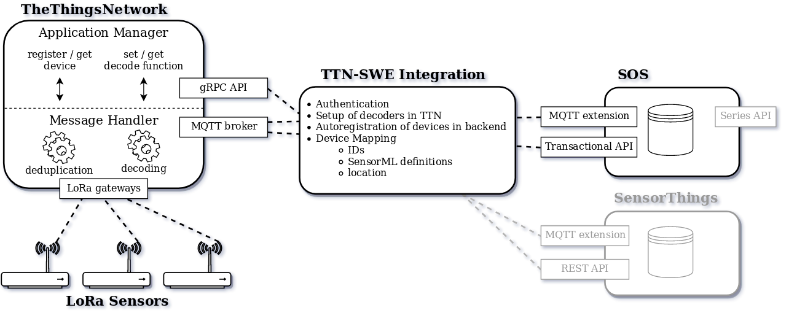

# Setting up a LoRa connected sensor with 52North SOS

This guide explains the steps necessary to deploy a sensor that transmits its observations via LoRaWAN into the OGC SensorWeb.

1. [Introduction](#introduction)
2. [TheThingsNetwork registration](#thethingsnetwork-registration)
3. [Setting up the ttn-ogcswe-integration](#setting-up-the-ttn-ogcswe-integration)
4. [The Sensor](#the-sensor)

## Introduction
LoRaWAN is a rather new radio communications protocol providing high transmission range (up to 20 km) at low energy usage and bandwith (3 - 300 kbps).
Devices send messages, hoping that a gateway will receive it.

Because the used frequencies are in unlicensed bands, there are multiple competing networks that provide gateways and the backend infrastructure that is required to deduplicate these messages and translate them into a TCP/IP network; the web.
[TheThingsNetwork](https://thethingsnetwork.org) (TTN) is one implementation of such a network. It's special because the whole software is FOSS, and the gateway deployments are community driven: Anybody can deploy a gateway and link it to the network, which gives the infrastructure arbitrary geographic coverage.

To send and receive messages, devices must be registered in TTN. External applications (the SOS in our case) can then subscribe to these messages from an MQTT broker.

Because the SOS does not provide a way to subscribe to a MQTT broker to insert observations but uses a REST API ('Transactional API'), there is a bridge required.
This bridge additionally automates tasks such as sensor registration & message decoder definition, removing administrative overhead.

With this architecture the event flow can be described as follows:

- Initial deployment

    1. User registers application in TTN
    2. User configures & deploys ttn-ogcswe-integration
    3. Integration configures message decoders & subscribes to messages

- Sensor setup

    3. User registers sensing device in TTN
    4. User configures & deploys sensor hardware

- Sensor operation

    5. Device transmits observation
    6. TTN decodes message & passes it to Integration
    7. Integration maps device to sensor in SOS, or creates one if not found
    8. Integration sends observation to SOS for the found sensor

This means that there's no need to register a device twice in both TTN and SOS. All configuration is declarative, always in sync between both components, and done only once!

## TheThingsNetwork registration
Create an account at <https://account.thethingsnetwork.org/register> to register the phyisical device and the integration as application in TTN.
> In TTN a *Device* always belongs to an *Application*. An application is just a logical construct to manage access control and message decoders.

### Application
1. First we register a new application in TTN at <https://console.thethingsnetwork.org/applications/add>.
Choose an *Application ID* & *Handler* and note the values.
2. Next add a new *Access Key* to this application specifically for the ttn-ogcswe-integration at `https://console.thethingsnetwork.org/applications/<YOUR-APP-ID>/settings/access-keys/add`.
Give it the right to change *settings* and read *messages*. Note the key somewhere.
    > This step is technically not required but good security practice.

### Device
3. Add a new device to the application at `https://console.thethingsnetwork.org/applications/<YOUR-APP-ID>/devices/register`.
4. Only if you *don't* know what you're doing: Set the *Activation Method* to `ABP` at `https://console.thethingsnetwork.org/applications/<YOUR-APP-ID>/devices/<YOUR-DEVICE-ID>` and note the resulting *Device Address*, *Network Session Key*, *App Session Key*.
5. Make sure the device has the geographic location of its deployment defined at `https://console.thethingsnetwork.org/applications/<YOUR-APP-ID>/devices/<YOUR-DEVICE-ID>/settings/location`.

## Setting up the ttn-ogcswe-integration
The integration can set up one or more bridges to local or remote OGC SWE storage backends.
Multiple backend APIs are supported, but in this guide we will use the SOS Transcational API.
The bridge is configured through a single YAML file (`config.yml`).
Please refer to the configuration template for an explanation of each option.

1. Follow the [installation instructions](https://github.com/noerw/ttn-ogcswe-integration)
2. Configure the Integration through `config.yml`
    - Insert the *Application ID* and *Access Key*
    - Set `broker.type` to `SOS:transactional`
    - Set the sensor's observed properties in `sensors`
3. Make shure the Transactional API is enabled in the SOS admin panel, and Transactional Security is configured correctly.
4. Launch it!

As soon as the sensing device transmits an observation, the integration will receive it, and pass it to the SOS, creating the appropriate sensor when needed.

### Deployment
The bridge needs to be deployed on a internet connected machine (but there are no inbound ports required).
There is a [Docker image](https://hub.docker.com/r/noerw/ttn-ogcswe-integration/) for easy deployment.

If you can't use an existing SOS instance and need to set one up anyway, the [Docker setup guide](https://github.com/noerw/ttn-ogcswe-integration/tree/master/docker) simplifies things further.

## The sensor
To connect the sensing device with a LoRa network it needs a dedicated chip; the RN2483 is a good low cost option.
For Arduino based solutions the [Dragino LoRa Shield](http://www.dragino.com/products/module/item/102-lora-shield.html) is easy to use along with [this library](https://github.com/jpmeijers/RN2483-Arduino-Library).

> Make shure that the observations to be transmitted have an encoding matching the decoder as defined in the integration configuration!

Once the values you received when registering a device in TTN are inserted into the firmware, it is ready to be deployed!
